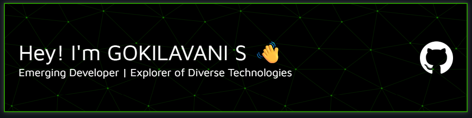

---

<!-- ABOUT ME -->
## 👩‍💻 About Me

Hello! I'm GOKILAVANI S, an enthusiastic independent developer passionate about exploring a wide spectrum of technologies. I thrive on experimenting with new tools, languages, and frameworks—constantly driven by a desire to learn, create, and innovate. My journey is just beginning, and I'm excited to connect, collaborate, and grow within the global tech community.

---

### 🐍 GitHub Snake

  

---

<h2 align="center">🚀 Tech Stack</h2> 
 
<picture>
  <source media="(prefers-color-scheme: dark)" srcset="./Skills_Animation_Dark.gif">
  <source media="(prefers-color-scheme: light)" srcset="./Skills_Animation_White.gif">
  
</picture>
 

<h3 align="left">💡 Skills & Current Learnings</h3>

<ul align="left">
  <li>🤖 <strong>AI & Machine Learning:</strong> Model training, image processing, and automation using Python, Google Colab & MATLAB.</li> 

  <li>🧠 <strong>Deep Learning:</strong> Understanding neural networks and applying TensorFlow for basic model development.</li> 

  <li>💻 <strong>Web Development:</strong> Learning React.js, JSX, component-based design, and UI state management.</li> 

  <li>☁️ <strong>Cloud & DevOps:</strong> Exposure to AWS, Azure, Docker, CI/CD pipelines, and GitHub workflows.</li> 

  <li>🛠️ <strong>Languages & Tools:</strong> C, Java, Python, SQL (basic), MATLAB, VS Code, Google Colab.</li>
</ul>

---

<!-- FEATURED PROJECTS -->
## 🌟 Featured Projects</h2>

While my GitHub is just getting started, I'm eager to build and share impactful projects in the near future. Here's a glimpse of what's coming:

- **gokilavani19**  
  <em>Personal learning lab for experimenting with diverse languages and development patterns.</em>  
   

Stay tuned for innovative projects as I grow my portfolio!

---

<!-- GITHUB ACTIVITY -->
## 📊 GitHub Stats & Activity

  
  

---

### 🔥 Contribution Streak

  

---

<!-- CONNECT -->
## 🤝 Connect & Collaborate

I'm always open to connecting with fellow developers, learning new technologies, and collaborating on innovative ideas.  
**Let's shape the future of tech together!**

- Want to collaborate or chat?  
  → [Follow me on GitHub](https://github.com/gokilavani-02) and let's spark a conversation in the issues or discussions!

---

  <em>“Every expert was once a beginner—let's keep pushing boundaries!”</em>

  

